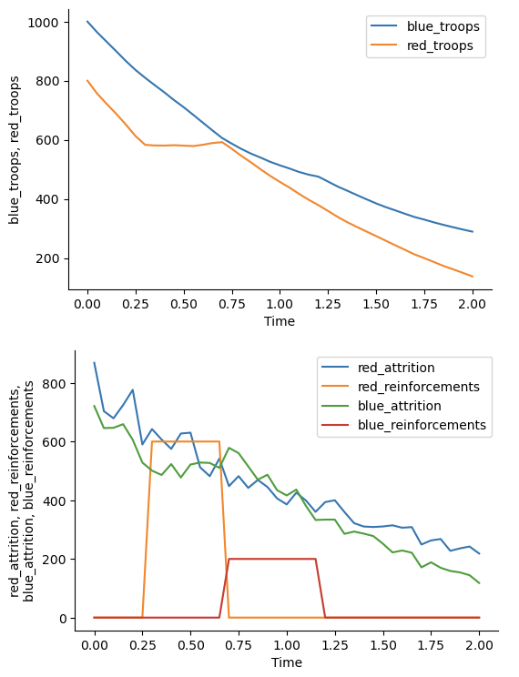
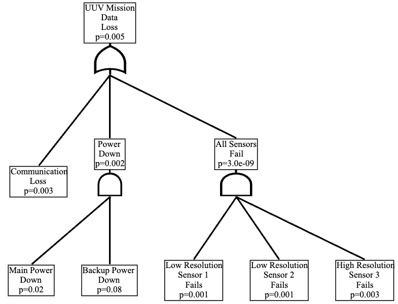
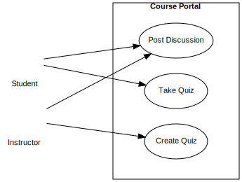

## Examples

[](https://colab.research.google.com/drive/1J0Dnb2qmoMiuJWJTAsMQ5c3F6vjn4CzQ?usp=sharing) Open these examples in a Google Colaboratory Notebook.

### Simulations

Simulation models in se-lib are defined as logical nodes in a system and their connections. Function calls enable system dynamics models to be expressed as stocks, flows and auxiliary variables connected in feedback loops. Discrete event models are defined as connected path nodes for entity generation, delays, queues/servers, and termination nodes.  

Utilities are provided for output visualization and statistical analysis.  Hybrid models and can be developed with relationships between continuous and discrete event parameters.  

The following are available online:
* [se-lib system dynamics examples](<https://colab.research.google.com/drive/1oE5TBdF-hpJTQbQgSmPgmPoofBgOTR0B?usp=sharing>) on Google Colab
* [Discrete event modeling and simulation](<http://se-lib.org/online/discrete_event_modeling_demo.html> "Discrete event modeling and simulation demonstrations") on se-lib playground

See the following manuals for further details.
* [System Dynamics Modeling with se-lib User's Guide v. 1.0](<http://se-lib.org/manuals/System_Dynamics_Modeling_with_se_lib_User_s_Guide _1_.pdf>)

#### System Dynamics Model


```python
# Battle Simulator using Lanchester's Law for Aimed Fire with Reinforcements

init_sd_model(start=0, stop=2, dt=.05)

step_size = 600

add_stock("blue_troops", 1000, inflows=["blue_reinforcements"], outflows=["blue_attrition"])
add_flow("blue_attrition", "red_troops*red_lethality")
add_flow("blue_reinforcements", "step(200, .7)-step(200, 1.2)")
add_auxiliary("blue_lethality", "random.uniform(.7, .9)")

add_stock("red_troops", 800, inflows=["red_reinforcements"], outflows=["red_attrition"])
add_flow("red_attrition", "blue_troops*blue_lethality")
add_flow("red_reinforcements", f"step({step_size}, .3)-step({step_size}, .7)")
add_auxiliary("red_lethality", "random.uniform(.8, 1.0)")

run_model()

save_graph(['blue_troops', 'red_troops'], filename="battle_simulator_troop_levels")
save_graph(["red_attrition", "red_reinforcements", 'blue_attrition', 'blue_reinforcements'], filename="battle_simulator_flow_rates")
```




#### Discrete Event Model

```python
# electric car charging simulation
init_de_model()

add_source('incoming_cars',
           entity_name="Car",
           num_entities = 50,
           connections={'charger': .7, 'impatient_cars': .3},
           interarrival_time='np.random.exponential(5)')

add_server(name='charger',
           connections={'payment': 1},
           service_time='np.random.uniform(0, 16)',
           capacity = 1)

add_delay(name='payment',
           delay_time = 'np.random.uniform(1, 3)',
           connections={'served_cars': 1},)

add_terminate('served_cars')
add_terminate('impatient_cars')

draw_model_diagram()

model_data, entity_data = run_model()
plot_histogram(model_data['charger']['waiting_times'], xlabel="Charger Waiting Time")
```  


### Analyses

#### Quantitative Fault Tree

```python
# UUV computed fault tree given probabilities for basic events
uuv_fault_tree = [
    ("UUV Mission Data Loss", "or", '', ["Communication Loss", "Power Down", "All Sensors Fail"]),
    ('All Sensors Fail', 'and', '', ['Low Resolution Sensor 1 Fails', 'Low Resolution Sensor 2 Fails', 'High Resolution Sensor 3 Fails']),
    ('Power Down', 'and', '', ["Main Power Down", "Backup Power Down"]),
    ('Communication Loss', 'basic', .003),
    ('Main Power Down', 'basic', .02),    
    ('Backup Power Down', 'basic', .08),
    ('Low Resolution Sensor 1 Fails', 'basic', .001),
    ('Low Resolution Sensor 2 Fails', 'basic', .001),
    ('High Resolution Sensor 3 Fails', 'basic', .003),
    ]

se.draw_fault_tree_diagram_quantitative(uuv_fault_tree, filename="uuv_quantitative_fault_tree", format="svg")
```




#### Critical Path Analysis

A critical path can be computed from a set of tasks with associated time durations and dependencies as below.

```python
# tasks, durations and dependencies
tasks = [('A', {'Duration': 3}),
         ('B', {'Duration': 5}),
         ('C', {'Duration': 2}),
         ('D', {'Duration': 3}),
         ('E', {'Duration': 5})]

task_dependencies = [('A', 'C'),
                ('B', 'C'),
                ('A', 'D'),
                ('C', 'E'),
                ('D', 'E')]

# create diagram
se.critical_path_diagram(tasks, task_dependencies, filename="critical_path")
```


### Diagrams

These examples generate diagrams to be displayed from a Python console or Jupyter Notebook.  After importing se-lib, model elements can be specified as simple lists.  Element relationships are designated as lists of tuple pairs. The output filenames are optional and used here to generate the included SVG images.


#### Use Case Model

Actors and use cases are first specified in lists.  The interactions between actors and use cases are identified by their tuple pairs and drawn accordingly on the diagram.

```python
import selib as se

# system model
system_name = "Course Portal"
actors = ['Student', 'Instructor']
use_cases = ['Post Discussion', 'Take Quiz', 'Create Quiz']
interactions = [('Student', 'Post Discussion'), ('Instructor', 'Post Discussion'), ('Student', 'Take Quiz'), ('Instructor', 'Create Quiz')]
use_case_relationships = []

# create diagram
se.use_case_diagram(system_name, actors, use_cases, interactions, use_case_relationships, filename=system_name+'use case diagram.pdf')
 ```



#### Sequence Model

A sequence diagram can be constructed per the following.

```python
# system model
system_name = "Battle Simulator"
actors = ['Battle Planner']
objects = ['main']
actions = [
('Battle Planner', 'main', 'run()'),
('main', 'Battle Planner', 'request for side 1 name'),
('Battle Planner', 'main', 'side 1 name'),
('main', 'Battle Planner', 'request for side 2 name'),
('Battle Planner', 'main', 'side 2 name'),
('main', 'Battle Planner', 'request for side 1 starting level'),
('Battle Planner', 'main', 'side 1 starting level'),
('main', 'Battle Planner', 'request for side 1 lethality coefficient'),
('Battle Planner', 'main', 'side 1 lethality coefficient'),
('main', 'Battle Planner', 'request for side 2 starting level'),
('Battle Planner', 'main', 'side 2 starting level'),
('main', 'Battle Planner', 'request for side 2 lethality coefficient'),
('Battle Planner', 'main', 'side 2 lethality coefficient'),
('main', 'Battle Planner', 'time history of troops and victor'),
]

# create diagram
se.sequence_diagram(system_name, actors, objects, actions, filename=system_name+"_sequence_diagram")
```


#### Context Model

```python
# system model
system_name = "Python Interpreter with PyML"
external_actors = ["User", "OS", "Graphviz"]
# create context diagram
se.context_diagram(system_name, external_actors, filename="pyml_context_diagram_offline")
```


#### Requirements Model

```python
# Intelligence, Surveillance, & Reconnaissance Unmanned Underwater Vehicle (ISR UUV) un-numbered requirements
requirements = [("ISR UUV", "Performance"),
                ("Performance",
                ("The UUV shall be capable of completing a mission of 6 hours duration.",
                "The UUV shall be capable of a top speed of 14 knots.",
                "The UUV shall be capable of surviving in an open ocean environment to a depth of 1500 meters.",
                "The UUV shall avoid detection.")),
                ("ISR UUV", "Communication"),
                ("Communication",
                ("Mission parameters shall be uploadable to the UUV",
                "The UUV shall receive remote commands",
                "The UUV shall commence its mission when commanded",
                "The UUV shall be capable of transmitting data in a host ship compatible format",
                "The UUV shall indicate that it is ready for recovery")),]

# draw requirements diagram as horizontal tree left -> right
se.requirements_diagram(requirements, rankdir='LR', filename="uuv_requirements_tree")
```


#### Work Breakdown Structure

```python
# project work breakdown structure
wbs_decompositions = [
('Skateboard', 'Hardware'), ('Skateboard', 'Software'), ('Skateboard', 'Integration and Test'),
                ('Hardware', 'Board'), ('Hardware', 'Wheels'), ('Hardware', 'Mounting'),
                ('Software', 'OS'), ('Software', 'GPS Driver'), ('Software', 'Route Tracking'),
                ('Integration and Test', 'Fixed Platform'), ('Integration and Test', 'Street Testing')]

# create diagram
se.wbs_diagram(wbs_decompositions, filename="skateboard_wbs")
```


#### Design Structure Matrix

```python
tasks = ['Make Board', 'Acquire Wheels', 'Assemble', 'Test']
task_dependencies = [('Make Board', 'Assemble'), ('Acquire Wheels', 'Assemble'), ('Assemble', 'Test'), ('Test', 'Assemble')]
se.design_structure_matrix(tasks, task_dependencies, filename="skateboard_task_dsm_with_feedback")
```

<div style="text-align: center">
<?xml version="1.0" encoding="UTF-8" standalone="no"?>
<!DOCTYPE svg PUBLIC "-//W3C//DTD SVG 1.1//EN"
 "http://www.w3.org/Graphics/SVG/1.1/DTD/svg11.dtd">
<!-- Generated by graphviz version 2.40.1 (20161225.0304)
 -->
<!-- Title: dsm Pages: 1 -->
<svg width="387pt" height="121pt"
 viewBox="0.00 0.00 387.00 121.00" xmlns="http://www.w3.org/2000/svg" xmlns:xlink="http://www.w3.org/1999/xlink">
<g id="graph0" class="graph" transform="scale(1 1) rotate(0) translate(4 117)">
<title>dsm</title>
<polygon fill="#ffffff" stroke="transparent" points="-4,4 -4,-117 383,-117 383,4 -4,4"/>
<!-- dsm -->
<g id="node1" class="node">
<title>dsm</title>
<polygon fill="none" stroke="#000000" points="8.5,-87.5 8.5,-108.5 105.5,-108.5 105.5,-87.5 8.5,-87.5"/>
<polygon fill="none" stroke="#000000" points="105.5,-87.5 105.5,-108.5 181.5,-108.5 181.5,-87.5 105.5,-87.5"/>
<text text-anchor="start" x="108.5" y="-94.3" font-family="Times,serif" font-size="14.00" fill="#000000">Make Board</text>
<polygon fill="none" stroke="#000000" points="181.5,-87.5 181.5,-108.5 278.5,-108.5 278.5,-87.5 181.5,-87.5"/>
<text text-anchor="start" x="184.5" y="-94.3" font-family="Times,serif" font-size="14.00" fill="#000000">Acquire Wheels</text>
<polygon fill="none" stroke="#000000" points="278.5,-87.5 278.5,-108.5 340.5,-108.5 340.5,-87.5 278.5,-87.5"/>
<text text-anchor="start" x="281.5" y="-94.3" font-family="Times,serif" font-size="14.00" fill="#000000">Assemble</text>
<polygon fill="none" stroke="#000000" points="340.5,-87.5 340.5,-108.5 371.5,-108.5 371.5,-87.5 340.5,-87.5"/>
<text text-anchor="start" x="343.5" y="-94.3" font-family="Times,serif" font-size="14.00" fill="#000000">Test</text>
<polygon fill="none" stroke="#000000" points="8.5,-66.5 8.5,-87.5 105.5,-87.5 105.5,-66.5 8.5,-66.5"/>
<text text-anchor="start" x="22" y="-73.3" font-family="Times,serif" font-size="14.00" fill="#000000">Make Board</text>
<polygon fill="#000000" stroke="transparent" points="105.5,-66.5 105.5,-87.5 181.5,-87.5 181.5,-66.5 105.5,-66.5"/>
<polygon fill="none" stroke="#000000" points="105.5,-66.5 105.5,-87.5 181.5,-87.5 181.5,-66.5 105.5,-66.5"/>
<polygon fill="none" stroke="#000000" points="181.5,-66.5 181.5,-87.5 278.5,-87.5 278.5,-66.5 181.5,-66.5"/>
<polygon fill="none" stroke="#000000" points="278.5,-66.5 278.5,-87.5 340.5,-87.5 340.5,-66.5 278.5,-66.5"/>
<polygon fill="none" stroke="#000000" points="340.5,-66.5 340.5,-87.5 371.5,-87.5 371.5,-66.5 340.5,-66.5"/>
<polygon fill="none" stroke="#000000" points="8.5,-45.5 8.5,-66.5 105.5,-66.5 105.5,-45.5 8.5,-45.5"/>
<text text-anchor="start" x="11.5" y="-52.3" font-family="Times,serif" font-size="14.00" fill="#000000">Acquire Wheels</text>
<polygon fill="none" stroke="#000000" points="105.5,-45.5 105.5,-66.5 181.5,-66.5 181.5,-45.5 105.5,-45.5"/>
<polygon fill="#000000" stroke="transparent" points="181.5,-45.5 181.5,-66.5 278.5,-66.5 278.5,-45.5 181.5,-45.5"/>
<polygon fill="none" stroke="#000000" points="181.5,-45.5 181.5,-66.5 278.5,-66.5 278.5,-45.5 181.5,-45.5"/>
<polygon fill="none" stroke="#000000" points="278.5,-45.5 278.5,-66.5 340.5,-66.5 340.5,-45.5 278.5,-45.5"/>
<polygon fill="none" stroke="#000000" points="340.5,-45.5 340.5,-66.5 371.5,-66.5 371.5,-45.5 340.5,-45.5"/>
<polygon fill="none" stroke="#000000" points="8.5,-24.5 8.5,-45.5 105.5,-45.5 105.5,-24.5 8.5,-24.5"/>
<text text-anchor="start" x="29" y="-31.3" font-family="Times,serif" font-size="14.00" fill="#000000">Assemble</text>
<polygon fill="none" stroke="#000000" points="105.5,-24.5 105.5,-45.5 181.5,-45.5 181.5,-24.5 105.5,-24.5"/>
<text text-anchor="start" x="138" y="-31.3" font-family="Times,serif" font-size="14.00" fill="#000000">X</text>
<polygon fill="none" stroke="#000000" points="181.5,-24.5 181.5,-45.5 278.5,-45.5 278.5,-24.5 181.5,-24.5"/>
<text text-anchor="start" x="224.5" y="-31.3" font-family="Times,serif" font-size="14.00" fill="#000000">X</text>
<polygon fill="#000000" stroke="transparent" points="278.5,-24.5 278.5,-45.5 340.5,-45.5 340.5,-24.5 278.5,-24.5"/>
<polygon fill="none" stroke="#000000" points="278.5,-24.5 278.5,-45.5 340.5,-45.5 340.5,-24.5 278.5,-24.5"/>
<polygon fill="none" stroke="#000000" points="340.5,-24.5 340.5,-45.5 371.5,-45.5 371.5,-24.5 340.5,-24.5"/>
<text text-anchor="start" x="350.5" y="-31.3" font-family="Times,serif" font-size="14.00" fill="#000000">X</text>
<polygon fill="none" stroke="#000000" points="8.5,-3.5 8.5,-24.5 105.5,-24.5 105.5,-3.5 8.5,-3.5"/>
<text text-anchor="start" x="44.5" y="-10.3" font-family="Times,serif" font-size="14.00" fill="#000000">Test</text>
<polygon fill="none" stroke="#000000" points="105.5,-3.5 105.5,-24.5 181.5,-24.5 181.5,-3.5 105.5,-3.5"/>
<polygon fill="none" stroke="#000000" points="181.5,-3.5 181.5,-24.5 278.5,-24.5 278.5,-3.5 181.5,-3.5"/>
<polygon fill="none" stroke="#000000" points="278.5,-3.5 278.5,-24.5 340.5,-24.5 340.5,-3.5 278.5,-3.5"/>
<text text-anchor="start" x="304" y="-10.3" font-family="Times,serif" font-size="14.00" fill="#000000">X</text>
<polygon fill="#000000" stroke="transparent" points="340.5,-3.5 340.5,-24.5 371.5,-24.5 371.5,-3.5 340.5,-3.5"/>
<polygon fill="none" stroke="#000000" points="340.5,-3.5 340.5,-24.5 371.5,-24.5 371.5,-3.5 340.5,-3.5"/>
</g>
</g>
</svg>
</div>


#### Read Fault Tree from Excel

Portion of example Excel file *aav_fault_tree.xlsx*:


```python
# read fault tree from Excel file into list of nodes
fault_tree_list = se.read_fault_tree_excel('aav_fault_tree.xlsx')

# create fault tree diagram
se.fault_tree_diagram(fault_tree_list)

```


#### Causal Diagram

```python
# causal relationships
relationships = [('Available personnel',"Workforce gap", "-"),
    ('Required personnel',"Workforce gap", "+"),
    ("Workforce gap", "Hiring rate", "+"),
    ("Hiring rate", "Available personnel", "+"),
                ]

# draw diagram
se.causal_diagram(relationships)
```


