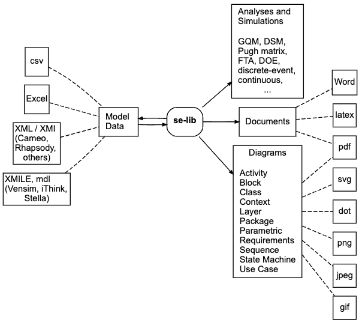

==============
Home
==============

Introduction
==============

.. meta::
   :title: Systems Engineering Library (se-lib)
   :description: Systems Engineering Library (se-lib)
   :keywords: se-lib, system engineering, system modeling, python modeling library, PyML, system modeling, SysML, UML, python, systems modeling language, unified modeling language, systems engineering, requirements diagram, use case diagram, sequence diagram, context diagram, work breakdown structure, WBS, wbs diagram, critical path, critical path diagram, fault tree analysis, fault tree diagram, fault tree cutsets, system dynamics, simulation, continuous systems

Welcome to the Systems Engineering Library (se-lib) (previously called PyML). It provides capabilities for integrated systems modeling, simulation, analysis and diagrams covering SysML, discrete event and continuous system dynamics simulation, reliability analysis, causal analysis, project management, and more using simple Python code as the glue.

The open source Python scientific computing ecosystem enables advanced analysis with powerful libraries and language features. se-lib is built with Graphviz, Matplotlib, NetworkX, NumPy and SciPy integrated with Python for all systems modeling.

**New Online Capability and Simulation**

The upcoming se-lib v.3 can run online in a browser. Try it at the `SysML Diagram Scratchpad <http://se-lib.org/online/scratchpad.html>`_ or the `Discrete Event Modeling Demonstrations <http://se-lib.org/online/discrete_event_modeling_demo.html>`_. We have also added :ref:`causal loop modeling<Causal Diagram>` (causal diagrams) and :ref:`system dynamics modeling and simulation<System Dynamics Model>` capabilities.

Inputs and Outputs
==============

The diagram below shows the primary inputs and outputs of se-lib, and was generated with se-lib utilities.

Current Features
==================

This current features of se-lib can be found under `Function Reference <function_reference.html>`_.

Presentations
==================

The following was presented at the2022 INCOSE San Diego Mini-Conference.

* `Introduction to PyML <http://pyml.fun/presentations/2022%20INCOSE%20San%20Diego%20Mini-Conference%20- %20Introduction%20to%20PyML.pdf>`_

Acknowledgments
==================

.. |csse_logo| image:: ./images/CSSE-logo-300x210.png
  :width: 30
  :target: https://boehmcsse.org

se-lib research and development is supported by these sponsors:

* |csse_logo| `Boehm Center for Systems and Software Engineering <https://boehmcsse.org/>`_
* Naval Postgraduate School Foundation
* Marine Corps Air Station (MCAS) Miramar

Feedback
==================

We value your feedback.  Tell us how we can make se-lib, its documentation and this website more useful. Please send comments, suggestions and interest in supporting the development to `info@se-lib.org <mailto:info@se-lib.org>`_.
